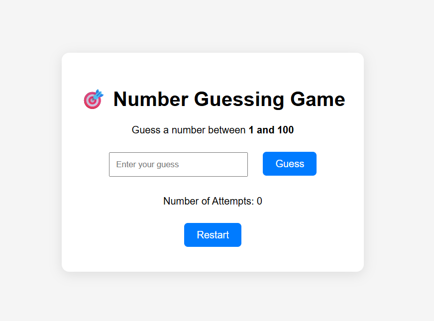

# 🎯 Number Guessing Game

A simple and interactive Number Guessing Game built using **HTML**, **CSS**, and **JavaScript**. The goal is to guess the randomly generated number between 1 and 100. The game gives feedback on whether your guess is too high or too low and tracks the number of attempts.

---

## 🚀 Features

- Generates a random number between 1 and 100.
- User-friendly input and feedback system.
- Tracks number of attempts.
- Restart functionality to play again.
- Responsive and minimal UI design.

---

## 📸 Screenshots

---

## 🔧 Technologies Used

- HTML5
- CSS3
- JavaScript (Vanilla)

---

## 🕹️ How to Play

1. Enter your guess in the input box.
2. Click on **"Guess"** to check your number.
3. The game will tell you if the number is higher or lower.
4. Keep guessing until you get it right!
5. Click **"Restart"** to play again.

---

## 📌 Demo

You can play the game live here:  
🔗 [Live Demo](#) *()*

---

## 📬 Contact

Made with ❤️ by [Mayank Kumar Gupta]  
🔗 [GitHub](https://github.com/MKG0007/number-guessing-game) | 📧 mg258087@gmail.com

---

